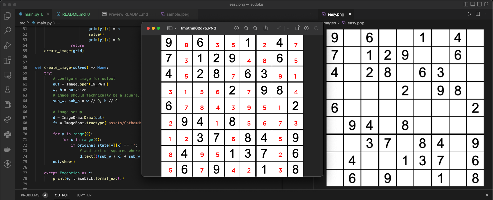

# Sudoku
In this project, I used a few Python libraries, mainly OpenCV (computer vision) and Google Tesseract (character recognition). 

The algorithm that solves the Sudoku puzzle is basic recursive backtracking (read: brute force), but I plan to implement the Knuth dancing-links algorithm as I iteratively improve on this project.

### Next Steps:
- Implement a more efficient algorithm to solve the Sudoku itself. See [Knuth Algorithm X](https://en.wikipedia.org/wiki/Knuth%27s_Algorithm_X).
- Use a machine learning library like Keras to read handwritten text on a partially complete puzzle.

## In Action:

